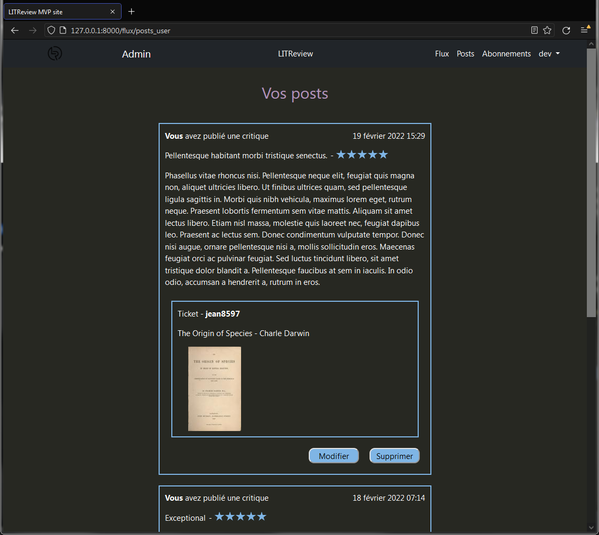

# MVP de LITReview #


1.  [Description](#description)
2.  [Installation](#installation)
3.  [Connexion](#connexion)
4.  [À propos](#a-propos)
    1.  [Bugs connus](#bugs-connus)


# Description <a name="description"></a> #


    Ce script à été réalisé dans le cadre d'un projet du parcours
    'Développeur d'application - Python' d'OpenClassRooms.

Application web pour demander et publier des critiques de livres ou d'articles.




# Installation <a name="installation"></a> #


0. Depuis un terminal, rendez-vous à la racine du projet.

1. Clonez ce dépôt à l'aide de la commande \
```git clone https://github.com/geoffrey-ll/P09_GL_LITReview .``` ou téléchargez-le [ici](https://github.com/geoffrey-ll/P09_GL_LITReview/archive/refs/heads/master.zip).

2. Créez un environnement virtuel avec `$ python -m venv env` sous Windows,\
ou ```$ python3 -m venv env``` sous macOS et Linux.

3. Activez l'environnement virtuel avec `$ env\Scripts\activate` sous Windows, \
ou `$ source env/bin/activate` sous macOS et Linux.

4. Installez les dépendances du projet avec `$ pip install -r requirements.txt`

5. Démarrez le serveur avec `$ python manage.py runserver`


Les étapes 1 à 4 ne sont nécessaires que pour la première utilisation.\
Seul les étapes 0 et 5 suffiront pour démarrer le serveur ultérieurement.


# Connexion <a name="connexion"></a> #


Vous pouvez accéder à  l'interface Admin avec le compte administrateur suivant :\
user : dev\
mdp : dddd__8888

Depuis l'espace Admin, vous pourrez gérer la base de données, y copmpris les comptes déjà présents.

Les mots de passe des autres comptes ont pour format :\
user : sarahj\
mdp : sarahjsarahj


# À propros <a name="a-propos"></a> #


## Bugs connus <a name="bugs-connus"></a> ##


Aucun bug connu.

\
Si vous trouvez un bug, merci de me le signaler sur l'adresse\
gl_openclassrooms@laposte.net
